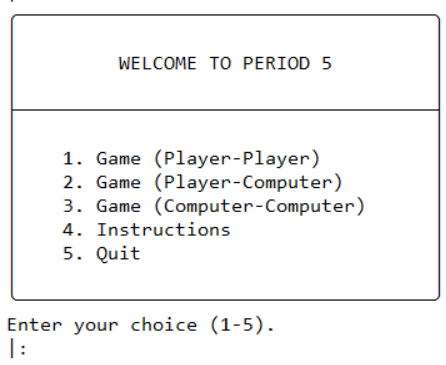

# Programação Funcional e Lógica - TP1 T04 Period 5_2  

## Participantes do Grupo 
- up201907715 - Bruno Rafael Oliveira Machado  (35%)
- up202004656 - Mariana Solange Monteiro Rocha (65%)

## Instalação e Execução 💽
No SICSTUS consulte o ficheiro `menu.pl` e corra o predicado `play.`.

## Descrição do Jogo 
Period 5 é um jogo de tabuleiro para 2 jogadores. Cada jogador tem 4 peças, para além disso há um cubo que é uma peça que ambos os jogadores podem mover.

### ⏹️ Tabuleiro 
A dimensão do tabuleiro é de 5 linhas por 5 colunas (5x5). Cada quadrado do tabuleiro tem uma cor correspondente (preto, vermelho, amarelo, azul ou roxo). Abaixo segue uma imagem da representação do tabuleiro bem como da disposição inicial das peças.


### 🎯 Objetivo do Jogo
O primeiro jogador a conseguir colocar as suas peças (4 peças próprias mais o cubo) em simultaneamente 5 quadrados de colunas e cores diferentes ganha.

### 🏃 Movimento
As rondas são alternadas, cada jogador pode mover na sua vez uma peça quantos quadrados vazios quiser na vertical ou na horizontal, desde que não salte nem se sobreponha a outras peças. 
O movimento das peças próprias não tem restrições para além das citadas na frase acima, no entanto o movimento do cubo tem duas condições:
- Não se pode mover o cubo para o quadrado do qual acabou de sair (ou seja anular a jogada anterior);
- Não se pode mover o cubo caso o oponente esteja a uma jogada de ganhar o jogo.
  
#### Fonte
https://www.iggamecenter.com/en/rules/period5 


## Lógica do Jogo

### Representação Interna do Estado de Jogo
#### 🧩 **Tabuleiro**
 O tabuleiro é representado por uma lista de listas em que cada lista representa uma linha no tabuleiro e cada posição da lista representa um quadrado do tabuleiro. O tabuleiro tem tamanho fixo (5x5).

#### 👤 **Jogador**
 Um jogador é representado pelos símbolos `●` (dark)ou `□` (light). O cubo é representado por `■`. O primeiro jogador é o jogador claro.

#### 🥚 **Estado Inicial** 
```([
    [empty, dark, empty, empty, empty],
    [light, empty, dark, empty, empty],
    [empty, light, cube, dark,  empty],
    [empty, empty, light, empty, dark],
    [empty, empty, empty, light, empty] 
], light, 2 , 2) 
```
Light é o primeiro jogador a jogar e (2,2) é a posição inicial do cubo (dado importante de guardar devido às regras de movimento da peça).


#### 🐣 **Estado Intermédio**
```([
    [empty, dark, empty, empty, empty],
    [light, dark, dark, empty, empty],
    [empty, light, empty, cube,  empty],
    [empty, empty, light, empty, dark],
    [empty, empty, empty, light, empty]
], light, 3, 2)
```


#### 🐔 **Estado Final**
```([
    [empty, dark, empty, empty, empty],
    [light, dark, dark, empty, empty],
    [empty, light, empty, empty,  cube],
    [empty, empty, light, empty, dark],
    [empty, empty, empty, light, empty] 
], dark, 4, 2) 
```


#### Visualização do estado do jogo
Após o começo do jogo, ao correr o predicado ``play.`` é apresentado o menu abaixo ao jogador.



O que o jogador tem de fazer para escolher uma opção é escrever o número relativo à mesma seguido de um ponto final e premir Enter. 
As opções, tal como é mostrado na imagem, são as seguintes:

- 1 - Player vs Player (modo de jogo player vs player)
- 2 - Player vs Computer (modo de jogo player vs computador) (NÃO IMPLEMENTADO)
- 3 - Computer vs Computer (modo de jogo computador vs computador) (NÃO IMPLEMENTADO)
- 4 - Instruções (exibe as instruções do jogo)
- 0 - Sair (sai do jogo, fechando o programa)

#### Validação de Movimentos e Execução
Todos os movimentos válidos a partir de uma posição são obtidos através do predicado `valid_moves`.
A execução do movimento é conseguida através dos predicados `user_move` e `perform_move`.
Visto que o Period 5 é um jogo em que não há peças a ser colocadas nem retiradas, apenas movimento das que já estão no tabuleiro é necessário pedir ao jogador para indicar que peça quer mexer. Tal é feito em ``user_move``. 

Após pedir as coordenadas em que a peça está e para a qual o jogador a quer mover é necessário avaliar se nas coordenadas indicadas inicialmente se encontra uma peça e que esta pertença ao jogador atual (ou que seja o cubo). Após isso é necessário verificar se a coordenada final é válida.
Para a coordenada final ser válida deve:
- Estar ou na mesma coluna ou na mesma linha da coordenada inicial da peça;
- Entre a coordenada inicial e a final não haver obstáculos;
- A coordenada final não estar ocupada.

Tais condições são verificadas em ``path_clear``.

Para além das peças de cada jogador, a peça "cubo" possui restrições no movimento entre as quais não voltar para a coordenada imediatamente anterior e não ser movida quando o rival está a uma jogada de ganhar a partida. A primeira condição é verificada no predicado ``perform_move``
e a segunda condição é verificada no predicado ``rival_next_to_win`` .

Abaixo segue o código relativo às funções mencionadas e funções das quais estas dependem.


``` prolog

valid_moves(Board, Player, Moves, LastCubeX, LastCubeY, CubeX, CubeY) :-
    setof(StartX-StartY-EndX-EndY, Board^Player^UpdatedBoard^NextPlayer^LastCubeX^LastCubeY^CubeX^CubeY^(perform_move(Board, StartX, StartY, EndX, EndY, UpdatedBoard, Player, NextPlayer, LastCubeX, LastCubeY, CubeX, CubeY)), Moves).
```


``` prolog

/*
* perform_move(+Board, +StartX, +StartY, +EndX, +EndY, -UpdatedBoard, +Player, -NextPlayer, +LastCubeX, +LastCubeY, +CubeX, +CubeY) :-
* Performs a move and checks if it is valid
*/
perform_move(Board, StartX, StartY, EndX, EndY, UpdatedBoard, Player, NextPlayer, LastCubeX, LastCubeY, CubeX, CubeY) :-
    nth0(StartY, Board, StartRow),      
    nth0(StartX, StartRow, Piece),          
    Piece \= empty, 
    (
        Piece = Player, CubeX = LastCubeX, CubeY = LastCubeY; 
        (Piece = cube, \+cube_cant_move(Board, Player), (LastCubeX \= EndX; LastCubeY \= EndY), CubeX = StartX, CubeY = StartY)
    ),    
    nth0(EndY, Board, EndRow),          
    nth0(EndX, EndRow, Destination),    
    Destination = empty,
    (StartX = EndX; StartY = EndY), 
    path_clear(Board, StartX, StartY, EndX, EndY), 
    update_board(Board, StartX, StartY, empty, TempBoard),
    update_board(TempBoard, EndX, EndY, Piece, UpdatedBoard), 
    next_player(Player, NextPlayer).

/*
* ask_coordinates(+StartX, +StartY, +EndX, +EndY) 
* Asks for the coordinates of the piece to move and for the coordinates that the player wants to move the piece to
*/
ask_coordinates(StartX, StartY, EndX, EndY) :-
    write('Enter the Column of the piece to move: '), read_number(StartX),
    write('Enter the Row coordinate of the piece to move: '), read_number(StartY),
    write('Enter the Column coordinate of where to move the piece: '), read_number(EndX),
    write('Enter the Row coordinate of where to move the piece: '), read_number(EndY).

/*
* user_move(+Board, +Player, -UpdatedBoard, +NextPlayer, +LastCubeX, +LastCubeY, +CubeX, +CubeY)
*  Treats all of the logic behind moving a piece
*/
user_move(Board, Player, UpdatedBoard, NextPlayer, LastCubeX, LastCubeY, CubeX, CubeY) :-
    ask_coordinates(StartX, StartY, EndX, EndY),
    (
      perform_move(Board, StartX, StartY, EndX, EndY, UpdatedBoard, Player, NextPlayer, LastCubeX, LastCubeY, CubeX, CubeY) 
    -> true  
    ; write('Invalid move, please try again.'), nl, 
      user_move(Board, Player, UpdatedBoard, NextPlayer, LastCubeX, LastCubeY, CubeX, CubeY)
    ).

take_turn(Board, Player, UpdatedBoard, NextPlayer, LastCubeX, LastCubeY, CubeX, CubeY) :-
    write('It is the '), write(Player), write(' player turn.'), nl,
    user_move(Board, Player, UpdatedBoard, NextPlayer, LastCubeX, LastCubeY, CubeX, CubeY).

/*
* path_clear(+Board, +StartX, +StartY, +EndX, +EndY) 
* Check if the path is clear between two points of the board
*/
path_clear(Board, StartX, StartY, EndX, EndY) :-
    (
        StartX = EndX -> 
        DiffY is (EndY - StartY),
        DiffY > 0 -> vertical_clear(Board, StartX, StartY, EndY, 1);  % Moving down
        vertical_clear(Board, StartX, StartY, EndY, -1)  % Moving up
    );
    (
        StartY = EndY -> 
        DiffX is (EndX - StartX),
        DiffX > 0 -> horizontal_clear(Board, StartY, StartX, EndX, 1);  % Moving right
        horizontal_clear(Board, StartY, StartX, EndX, -1)  % Moving left
    ).

/*
* Check if the path is clear between two points of the board (vertically)
*/
vertical_clear(_, _, EndY, EndY, _). % Reached end position
vertical_clear(Board, X, CurrentY, EndY, Step) :-
    NextY is CurrentY + Step,
    nth0(NextY, Board, Row),
    nth0(X, Row, Cell),
    Cell = empty, % The cell must be empty to be clear
    vertical_clear(Board, X, NextY, EndY, Step).

/*
* Check if the path is clear between two points of the board (horizontally)
*/
horizontal_clear(_, _, EndX, EndX, _). % Reached end position
horizontal_clear(Board, Y, CurrentX, EndX, Step) :-
    NextX is CurrentX + Step,
    nth0(Y, Board, Row),
    nth0(NextX, Row, Cell),
    Cell = empty, % The cell must be empty to be clear
    horizontal_clear(Board, Y, NextX, EndX, Step).


```

``` prolog
/*
* rival_next_to_win(+Board, +Player)
* Checks if rival is close to win.
*/
rival_next_to_win(Board, Player) :-
    ConditionsColors = [
        player_piece_in_black(Board, Player),
        player_piece_in_red(Board, Player),
        player_piece_in_yellow(Board, Player),
        player_piece_in_purple(Board, Player),
        player_piece_in_blue(Board, Player)
    ],
    count_true_conditions(CountColors, ConditionsColors),
    CountColors = 4,
    ConditionsColumns = [
        count_in_column(Board, 1, Player, 1),
        count_in_column(Board, 2, Player, 1),
        count_in_column(Board, 3, Player, 1),
        count_in_column(Board, 4, Player, 1),
        count_in_column(Board, 5, Player, 1)
    ],
    count_true_conditions(CountColumns, ConditionsColumns),
    CountColumns = 4.
```


#### 🔚 **Fim do Jogo**:
 A estratégia utilizada para verificar se o jogo chegou ao fim está implementada através do predicado ``game_over`` que verifica se algum jogador já colocou as 4 peças próprias e o cubo em simultanemante 5 colunas e 5 cores no tabuleiro, caso tal aconteça o jogo acaba e a esse jogador sai vencedor da partida.

#### Avaliação do Estado de Jogo
 Infelizmente, devido a uma gestão de tempo inapropriada esta função não foi completamente realizada estando parte dela implementada. A lógica por detrás seria avaliar todos os movimentos possíveis e de acordo com isso contar quais proporcionariam um maior número de colunas e cores ao mesmo tempo. Um procedimento para conseguir esse critério foi implementado, mas não nesse contexto (exemplo de uso: predicado ``rival_next_to_win`).


#### Jogadas do Computador
 Com muita pena nossa, tal como pronunciado no ponto anterior não conseguimos fazer uma gestão de tempo adequada tendo então deixado esta alínea por fazer. 


## Conclusões
Consideramos este trabalho muito interessante para perceber melhor o paradigma de Prolog que é uma linguagem bastante diferente do que estamos habituados. Um dos pontos fracos do nosso trabalho foi sem dúvida a má gestão de tempo tendo por isso ficado os bots por implementar (apesar de grande parte da lógica por trás estar implementada só faltar fazer o ciclo do jogo com o computador).
É sem dúvida uma lição que temos de levar para o futuro para que o próximo projeto corra pelo melhor.

## Bibliografia
- Slides da cadeira (moodle)
- https://www.iggamecenter.com/en/rules/period5 
- Chat GPT
- StackOverflow
- https://github.com/ttoino/feup-pfl-proj2 (procedure read_numbers)
