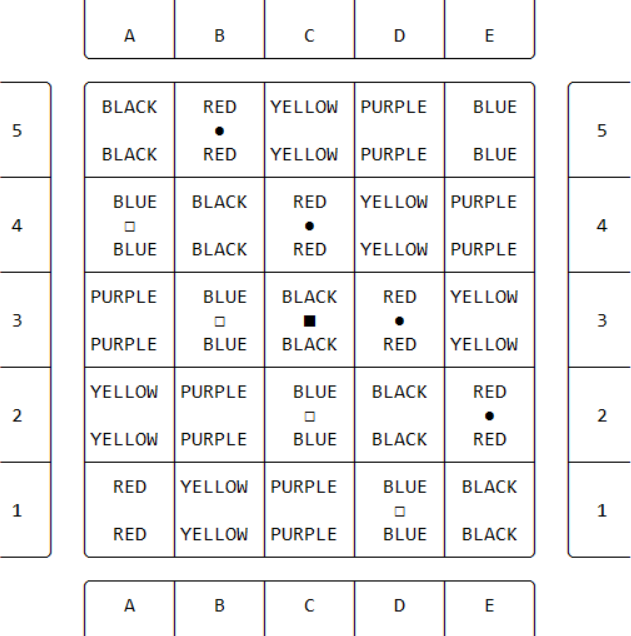
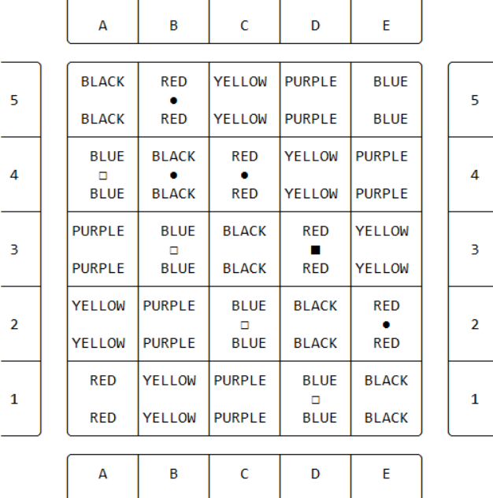

# Programação Funcional e Lógica - TP1 T04 Period 5_2  

## Participantes do Grupo 
- up20190xxxx - Bruno Rafael Oliveira Machado  (TBD%)
- up202004656 - Mariana Solange Monteiro Rocha (TBD%)

## Instalação e Execução 💽
### 🐧 Linux
TBD
### 🪟 Windows
TBD

## Descrição do Jogo 
Period 5 é um jogo de tabuleiro para 2 jogadores. Cada jogador tem 4 peças, para além disso há um cubo que é uma peça que ambos os jogadores podem mover.

### ⏹️ Tabuleiro 
A dimensão do tabuleiro é de 5 linhas por 5 colunas (5x5). Cada quadrado do tabuleiro tem uma cor correspondente (preto, vermelho, amarelo, azul ou roxo). Abaixo segue uma imagem da representação do tabuleiro bem como da disposição inicial das peças.


### 🎯 Objetivo do Jogo
O primeiro jogador a conseguir colocar as suas peças (4 peças próprias mais o cubo) em simultaneamente 5 quadrados de colunas e cores diferentes ganha.

### 🏃 Movimento
As rondas são alternadas, cada jogador pode mover na sua vez uma peça quantos quadrados vazios quiser na vertical ou na horizontal, desde que não salte nem se sobreponha a outras peças. 
O movimento das peças próprias não tem restrições para além das citadas na frase acima, no entanto o movimento do cubo tem duas condições:
- Não se pode mover o cubo para o quadrado do qual acabou de sair (ou seja anular a jogada anterior);
- Não se pode mover o cubo caso o oponente esteja a uma jogada de ganhar o jogo.
  
#### Fonte
https://www.iggamecenter.com/en/rules/period5 


## Lógica do Jogo

### Representação Interna do Estado de Jogo
#### 🧩 **Tabuleiro**
 O tabuleiro é representado por uma lista de listas em que cada lista representa uma linha no tabuleiro e cada posição da lista representa um quadrado do tabuleiro. O tabuleiro tem tamanho fixo (5x5).

#### 👤 **Jogador**
 Um jogador é representado pelos símbolos `●` (dark)ou `□` (light). O cubo é representado por `■`. O primeiro jogador é o jogador claro.

#### 🥚 **Estado Inicial** 
```([
    [empty, dark, empty, empty, empty],
    [light, empty, dark, empty, empty],
    [empty, light, cube, dark,  empty],
    [empty, empty, light, empty, dark],
    [empty, empty, empty, light, empty] 
], light)
```



#### 🐣 **Estado Intermédio**
```([
    [empty, dark, empty, empty, empty],
    [light, dark, dark, empty, empty],
    [empty, light, empty, cube,  empty],
    [empty, empty, light, empty, dark],
    [empty, empty, empty, light, empty]
], light)
```


#### 🐔 **Estado Final**
```([
    [empty, dark, empty, empty, empty],
    [light, dark, dark, empty, empty],
    [empty, light, empty, empty,  cube],
    [empty, empty, light, empty, dark],
    [empty, empty, empty, light, empty] 
], dark) 
```


#### 🔚 **Fim do Jogo**:
 A estratégia utilizada para verificar se o jogo chegou ao fim está implementada através do predicado ``game_over`` que verifica se algum jogador já colocou as 4 peças próprias e o cubo em simultanemante 5 colunas e 5 cores no tabuleiro, caso tal aconteça o jogo acaba e a esse jogador sai vencedor da partida.

#### 

## Conclusões
TBD Conclusions about the work carried out, including limitations of the program (known
issues), as well as possible improvements (roadmap) (up to 250 words);

## Bibliografia
- Slides da cadeira (moodle)
- https://www.iggamecenter.com/en/rules/period5 
- Chat GPT
- StackOverflow
