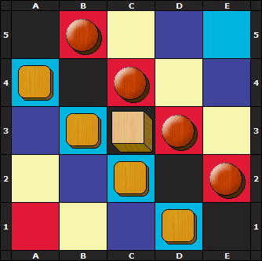

# Programação Funcional e Lógica - TP1 T04 Period 5_2  

## Participantes do Grupo
up20190xxxx - Bruno Rafael Oliveira Machado  (TBD%)
up202004656 - Mariana Solange Monteiro Rocha (TBD%)

## Instalação e Execução
TBD include all the necessary steps for the correct execution of the game in both
Linux and Windows environments (in addition to the installation of SICStus Prolog 4.8).

## Descrição do Jogo
Period 5 é um jogo de tabuleiro para 2 jogadores. Cada jogador tem 4 peças, para além disso há um cubo que é uma peça que ambos os jogadores podem mover.

### Tabuleiro
A dimensão do tabuleiro é de 5 linhas por 5 colunas (5x5). Cada quadrado do tabuleiro tem uma cor correspondente (preto, vermelho, amarelo, azul ou roxo). Abaixo segue uma imagem da representação do tabuleiro bem como da disposição inicial das peças.

### Objetivo do Jogo
O primeiro jogador a conseguir colocar as suas peças (4 peças próprias mais o cubo) em simultaneamente 5 quadrados de colunas e cores diferentes ganha.

### Movimento
As rondas são alternadas, cada jogador pode mover na sua vez uma peça quantos quadrados vazios quiser na vertical ou na horizontal, desde que não salte nem se sobreponha a outras peças. 
O movimento das peças próprias não tem restrições para além das citadas na frase acima, no entanto o movimento do cubo tem duas condições:
- Não se pode mover o cubo para o quadrado do qual acabou de sair (ou seja anular a jogada anterior);
- Não se pode mover o cubo caso o oponente esteja a uma jogada de ganhar o jogo.
  
#### Fonte
https://www.iggamecenter.com/en/rules/period5 

## Lógica do Jogo

### Representação Interna do Estado de Jogo
- **Tabuleiro**: lista de listas (cada elemento da sublista contém o que está dentro do quadrado a que corresponde);
- **Fim do Jogo**: 

## Conclusões
Conclusions about the work carried out, including limitations of the program (known
issues), as well as possible improvements (roadmap) (up to 250 words);

## Bibliografia
- Slides da cadeira (moodle)
- https://www.iggamecenter.com/en/rules/period5 
- Chat GPT
- StackOverflow
You can also include one or more imagesillustrating the execution of the game, showing initial, intermediate
and final game states (these game states can be hard-coded directly into the code file for this demonstration
of the game state visualization, using predicates similar to the initial_state/2 predicate).